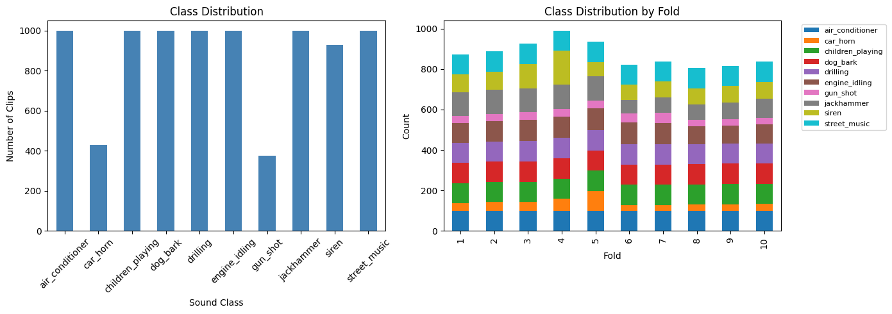
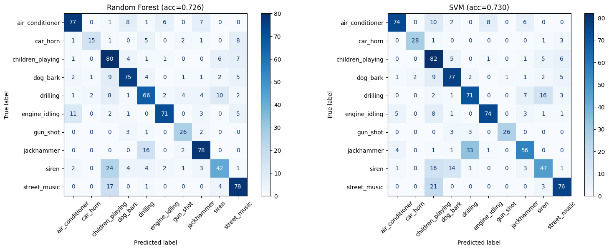
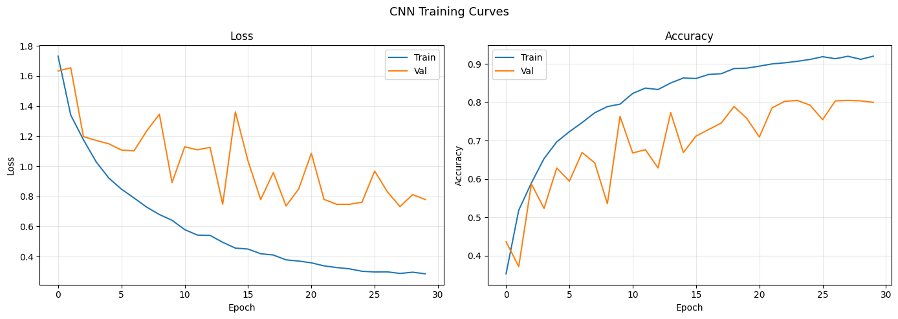
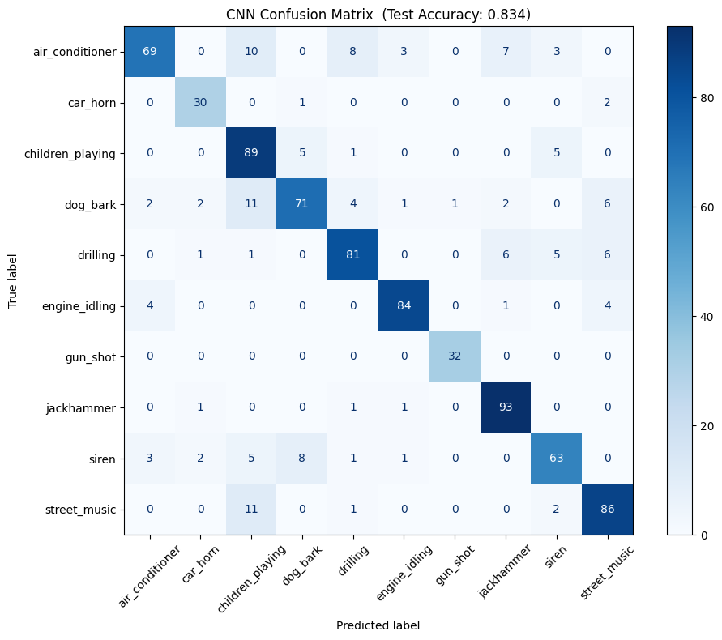
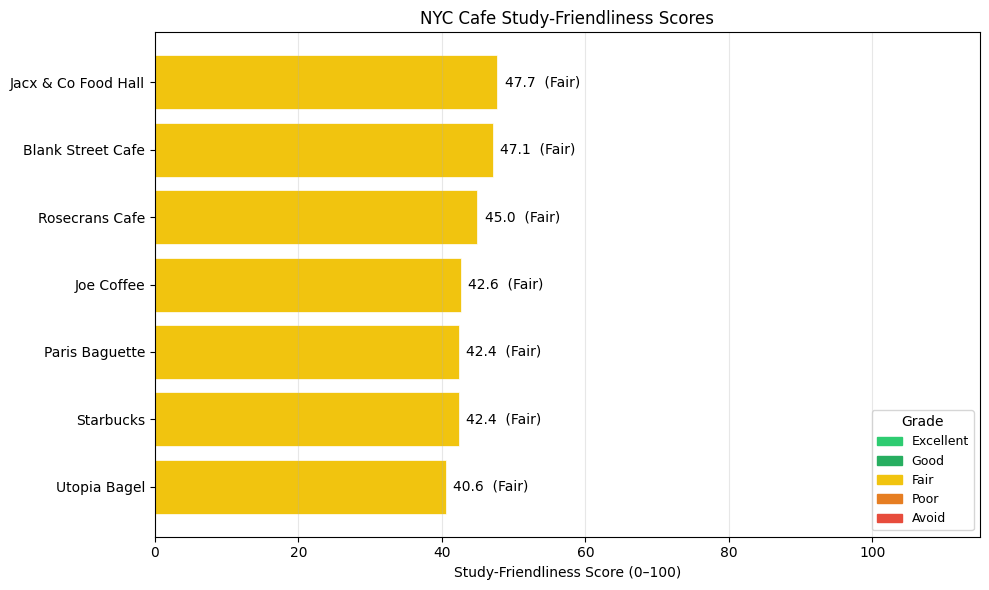
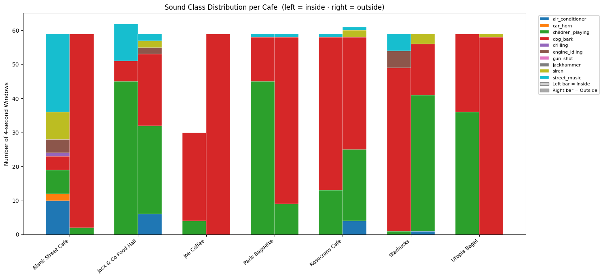

# Silence in the City: NYC Cafe Study-Friendliness from Sound

*Jun Lee — ML Class Project*

Code and notebooks: [github.com/lsj5081203/NYC-cafe-study-friendliness](https://github.com/lsj5081203/NYC-cafe-study-friendliness)

## Introduction

I study in cafes a lot, partly because my apartment is not always the easiest place to focus. The problem is that cafe reviews rarely tell me what I actually want to know. Google Maps covers coffee, seating, and ratings. It usually cannot tell me whether the sound in the room is the kind of background noise I can work through.

That is the detail I kept noticing. A steady air conditioner and a sudden car horn can have the same average decibel level, but they do not feel the same when I am trying to read or code. One fades into the room. The other interrupts me.

For this project I treated each cafe recording as a sequence of four-second sound snapshots. I trained an urban sound classifier on UrbanSound8K, ran it on my own recordings from seven NYC cafes, and converted the predicted classes into a study-friendliness score. I also added nearby public Wi-Fi as a positive signal and nearby eateries as a rough proxy for foot traffic.

The result was not the quiet-to-loud ranking I expected. All seven cafes landed in the "Fair" band, between 40.56 and 47.74 out of 100. That was frustrating at first, but it became the main lesson: a model trained on general urban sounds does not really know what to do with cafe ambience.

## Background & Related Work

### Urban Sound Classification

The main training dataset is UrbanSound8K, introduced by Salamon, Jacoby, and Bello in 2014. It contains 8,732 labeled clips across ten urban sound categories, from air conditioners and car horns to sirens and street music. The dataset is split into ten folds so that clips from the same original recording stay together. That fold structure matters because random splits can leak very similar sounds across train and test sets.

The original UrbanSound8K paper reported competitive baselines using hand-crafted audio features such as MFCCs. Piczak (2015) later showed that convolutional neural networks on spectrogram-like representations could improve environmental sound classification. Salamon and Bello (2017) pushed the idea further with data augmentation, including pitch shifting, time stretching, and background mixing.

For this project, the useful takeaway was the move from hand-designed summaries of sound toward learned time-frequency patterns. MFCCs compress an audio clip into features that describe its spectral shape. Mel-spectrograms keep more of the time structure, which makes them a better input for a CNN.

### Spatial Urban Data

The other ingredient was not audio at all. NYC Open Data publishes datasets such as public Wi-Fi hotspot locations and food establishment directories. These are not sound measurements, but they help describe the area around a cafe. Nearby public Wi-Fi may be convenient for studying. Many nearby eateries may mean a busier, noisier block.

### SONYC-UST-V2

I also looked at SONYC-UST-V2, a dataset of real NYC urban recordings from acoustic sensors. It has 18,510 recordings and a richer sound taxonomy than UrbanSound8K. I did not use it for training in the final pipeline because its labels and setup are different, but it is probably the more natural next dataset for this problem.

### Gap in Prior Work

The closest prior work is environmental sound classification and urban acoustic sensing. I did not find a project that turns cafe recordings plus urban context into a study-friendliness score. My contribution is not a new architecture; it is the application: using sound class predictions to ask a student-centered question about everyday places.

## Why Machine Learning?

The obvious shortcut is to measure loudness. That would be easier, and in some ways more honest. But loudness alone misses the part of the problem I care about.

Imagine two cafes with the same average volume. One has a low HVAC hum and occasional quiet conversation. The other has delivery trucks, horns, and a dog barking outside. A decibel meter can treat those as similar. A classifier can at least try to separate steady background sound from sharp interruptions.

I used ML for one narrow reason: it let me ask "what kind of sound is this?" rather than only "how loud is this?" The final score still needs caution because the model was trained on the wrong sound vocabulary for cafes. Without classification, the project would have collapsed into a simpler noise meter.

## Data

### UrbanSound8K

UrbanSound8K has 8,732 clips. Most classes have about 1,000 examples, while car horn and gun shot are smaller. I used the official folds: folds 1-8 for training, fold 9 for validation, and fold 10 for the main test result. I also ran 10-fold cross-validation for the baseline models.


*Figure 1: UrbanSound8K class distribution. Most classes are close to balanced; car horn and gun shot are smaller but still distinctive.*

### NYC Cafe Recordings

I recorded seven cafes in Greenwich Village, the West Village, and Long Island City: Blank Street Cafe, Jacx & Co Food Hall, Rosecrans Cafe, Joe Coffee, Paris Baguette, Starbucks, and Utopia Bagel. I chose places that looked plausible for studying: seating, decent reviews, and locations I could visit.

For each cafe I recorded about two minutes inside and two minutes outside on my phone, for 14 recordings total. The split mattered because a cafe can be calm once you sit down even if the block outside is loud.

### Spatial Data

I counted NYC public Wi-Fi hotspots within 200 meters of each cafe. Joe Coffee had the most nearby hotspots (6), followed by Rosecrans (5), Blank Street (4), Paris Baguette (3), Jacx & Co (2), Starbucks (2), and Utopia Bagel (1).

I also planned to count nearby eateries, but the NYC Open Data eatery endpoint returned HTTP 403 during inference. I left `eatery_count=0` for all cafes and treated that as a limitation. Since the eatery term has a 5% weight, the missing data changes the absolute scores modestly, but it still weakens the spatial part of the project.

## Methods

### Feature Extraction

For the Random Forest and SVM baselines, I represented each clip with 240 MFCC features: 40 coefficients, their deltas, their delta-deltas, and the mean and standard deviation of each over time.

For the CNN, I used 128-bin log-mel spectrograms. A 4-second clip at 22,050 Hz becomes a 128 by 173 image-like array. The vertical axis roughly corresponds to frequency, the horizontal axis to time, and the pixel values to energy.

### Baseline Classifiers

The baselines were a Random Forest with 200 trees and an RBF-kernel SVM with `C=10`. The SVM used a standard scaler. The Random Forest did not need scaling.

### CNN Architecture

The CNN has four convolutional blocks with 32, 64, 128, and 256 channels. Each block uses a 3 by 3 convolution, batch normalization, ReLU, and max pooling. After the convolutional stack, the model uses adaptive average pooling, dropout, and a final linear layer from 256 features to the 10 UrbanSound8K classes.

The model has about 390K parameters. I trained it for 30 epochs on a Colab A100 with Adam and cosine annealing. Best validation accuracy was 80.51% at epoch 24.

### Study-Friendliness Scoring

For each 4-second window in a cafe recording, the CNN predicts one UrbanSound8K class. I count those classes and convert the mix into a distraction score. Steady sounds get low weights: air conditioner is 0.10 and engine idling is 0.15. Sudden or harsh sounds get high weights: siren is 0.85, car horn is 0.90, drilling and jackhammer are 0.95, and gun shot is 1.00.

The acoustic score is:

```
acoustic_score = (1 - weighted_distraction) x 100
```

Then I add the spatial terms:

```
final_score = 0.9 x acoustic_score
            + 0.1 x min(wifi_count / 10, 1.0) x 100
            - 0.05 x min(eatery_count / 50, 1.0) x 100
```

The acoustic part dominates because the project is mainly about sound. The weights are subjective. I chose them based on what usually breaks my concentration, not from a survey.

## Experiments & Results

### Baseline Accuracy on UrbanSound8K

On the single fold-10 test split, the Random Forest reached 72.64% accuracy and the SVM reached 73.00%. In 10-fold cross-validation, the scores were lower: 67.36% +/- 4.49% for Random Forest and 68.24% +/- 5.54% for SVM. The difference matters because some folds are harder than others.


*Figure 2: Baseline confusion matrices on fold 10. The variable classes are harder; the sharper transient sounds are cleaner.*

### CNN Results

The CNN reached 83.39% test accuracy on fold 10. That is about 10.4 percentage points better than the SVM on the same split. I did not run 10-fold cross-validation for the CNN, so the fair comparison is against the single-split baseline results, not the baseline CV averages.


*Figure 3: CNN training curves. Validation accuracy levels off around 80%, and the train/validation gap stays fairly small.*

### Summary Comparison

| Model | Features | Single Split (Fold 10) | 10-Fold CV |
|-------|----------|------------------------|------------|
| Random Forest | MFCC (240-dim) | 72.64% | 67.36% +/- 4.49% |
| SVM (RBF, C=10) | MFCC (240-dim) | 73.00% | 68.24% +/- 5.54% |
| CNN (4-block) | Mel-spectrogram | 83.39% | not run |

### Per-Class Performance (CNN)

The easiest classes were gun shot, engine idling, jackhammer, and car horn. The hardest were dog bark, air conditioner, siren, and children playing. Some sound events have recognizable shapes, while others vary a lot from clip to clip.


*Figure 4: CNN confusion matrix on the test fold. Most remaining errors are between classes with overlapping spectra or variable timing.*

### Cafe Scoring Results

When I applied the CNN to my cafe recordings, every cafe landed in the "Fair" range.

| Cafe | Avg Score | Grade | Best Recording |
|------|-----------|-------|----------------|
| Jacx & Co Food Hall | 47.74 | Fair | 50.85 outside |
| Blank Street Cafe | 47.14 | Fair | 55.51 inside |
| Rosecrans Cafe | 44.95 | Fair | 46.23 outside |
| Joe Coffee | 42.60 | Fair | 41.33 inside |
| Paris Baguette | 42.42 | Fair | 47.97 inside |
| Starbucks | 42.42 | Fair | 46.36 outside |
| Utopia Bagel | 40.56 | Fair | 46.10 inside |


*Figure 5: Final cafe scores. The spread is only 7.2 points, which is too narrow for a useful recommendation system.*

### Inside vs. Outside Analysis

The most interesting individual result was Blank Street Cafe. Its inside recording scored 55.51, while its outside recording scored 40.34. That 15-point gap suggests the model did pick up something real about acoustic isolation. Jacx & Co, a food hall, had almost no inside/outside difference.


*Figure 6: Predicted class distribution for cafe recordings. Many windows are forced into mid-distraction UrbanSound8K classes because the model has no cafe-specific labels.*

## Analysis & Discussion

### What Worked

The audio classifier did what it was trained to do on UrbanSound8K. The CNN improved over the MFCC baselines, and the confusion matrices gave interpretable errors. The scoring pipeline was also easy to audit: each recording can be traced from windows, to class predictions, to an acoustic score, to a final score.

The inside/outside comparison also kept the project from being only a model leaderboard. Even with a limited model, Blank Street's indoor recording separated from its outdoor recording in a way that matched my own impression of the place.

### What Didn't Work

The final cafe ranking was weaker than I hoped. Seven cafes within 7.2 points is too compressed to guide a real decision. The missing eatery data also meant the spatial penalty was effectively off.

Most importantly, UrbanSound8K does not contain cafe sounds. There is no class for espresso machines, dishes, overlapping conversation, cash registers, or quiet background music. When the model hears those sounds, it still has to choose among siren, street music, children playing, and the other UrbanSound8K classes. That forced-choice setup pushes cafe recordings toward the middle of the scale.

### The Domain Gap Problem

This is the main result. The classifier can do urban sound classification, but that does not mean it understands cafe ambience. The training task and the deployment task are close enough to seem reasonable, but far enough apart to break the score.

This was the applied ML trap I had read about but not really seen in my own work. The benchmark accuracy looked fine, but the target environment had different categories. In my case, the failure was visible because all the cafe scores collapsed into the same band.

## Ethical Considerations

The main ethical issue is recording in public and semi-public spaces. Even though I did not transcribe speech or analyze content, raw audio can still contain fragments of conversations. A real version should process audio locally and store only class probabilities or summary scores.

There is also a fairness problem in the score itself. My distraction weights reflect my preferences. Other students may experience sound differently. A single score could also affect small businesses for reasons outside their control, like nearby construction or traffic. Any public-facing version should explain what the score measures and allow personalization.

## Limitations

1. **Domain gap** — UrbanSound8K lacks cafe-specific classes, so cafe sounds are forced into the wrong vocabulary.
2. **All "Fair" clustering** — The narrow score range is a model limitation, not proof that the cafes are equivalent.
3. **Eatery API 403** — The eatery penalty was not applied because the endpoint failed.
4. **No CNN cross-validation** — The CNN result is one held-out fold, not a full CV estimate.
5. **Small sample** — Seven cafes and one visit per setting are enough for a prototype, not a city-wide conclusion.
6. **Subjective weights** — The distraction weights need calibration from actual users.
7. **Temporal snapshot** — Cafe sound changes by time of day, day of week, and nearby street activity.

## Future Work

With three more months, I would start by collecting a small cafe-specific labeled dataset. Even a few hundred 4-second clips labeled as conversation, espresso machine, dishes, background music, traffic bleed, and quiet room tone would help more than adding complexity to the current model.

I would also fix the spatial data, record each cafe at several times of day, and let users adjust the distraction weights. After that, SONYC-UST-V2 would be useful for learning NYC-specific background sound patterns before fine-tuning on cafe recordings.

## Conclusion

I set out to rank NYC cafes by study-friendliness using sound classification. The classifier performed well on its benchmark, and the pipeline produced scores, figures, and reproducible notebooks. But the recommendation result was weak because the model did not have the right vocabulary for the environment.

That makes the project less of a finished cafe-ranking tool and more of a case study in mismatch. The technical pipeline worked; the deployment assumption did not. I do not see that as a total failure, but I would not ship the score as a recommendation app.

If I had to choose from the seven cafes based only on this experiment, I would trust the Blank Street inside recording the most. For everything else, I would treat the scores as a warning about domain mismatch, not as a guide to where to study.

## References

1. Salamon, J., Jacoby, C., & Bello, J. P. (2014). A Dataset and Taxonomy for Urban Sound Research. *Proceedings of the 22nd ACM International Conference on Multimedia*.
2. Piczak, K. J. (2015). Environmental Sound Classification with Convolutional Neural Networks. *IEEE International Workshop on Machine Learning for Signal Processing*.
3. Salamon, J., & Bello, J. P. (2017). Deep Convolutional Neural Networks and Data Augmentation for Environmental Sound Classification. *IEEE Signal Processing Letters*, 24(3), 279-283.
4. Cartwright, M., et al. (2020). SONYC Urban Sound Tagging (SONYC-UST): A Multilabel Dataset from an Urban Acoustic Sensor Network. *Proceedings of the Detection and Classification of Acoustic Scenes and Events Workshop (DCASE)*.
